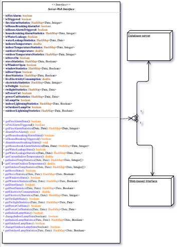
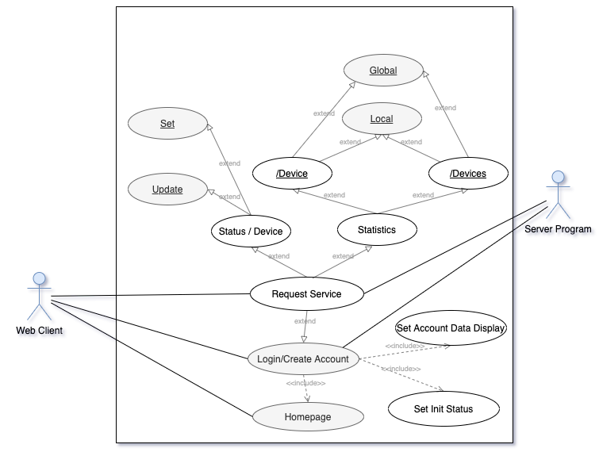
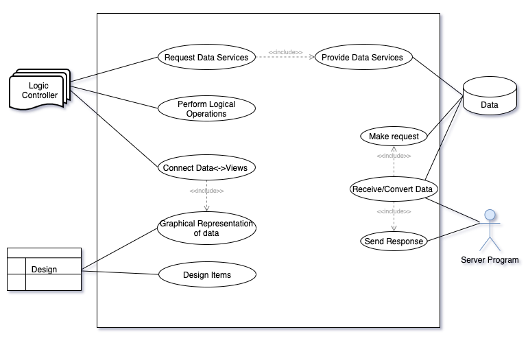

# Web-based GUI<!-- omit in toc -->
>Web interface for the Smart-House G3 Project

- [Introduction](#introduction)
- [Aim and purpose](#artifacts)
- [Artifacts](#aim-and-purpose)
  - [Vision](#vision)
  - [Design](#design)
  - [Requirements](#requirements)
  - [Supplimentary Requirements](#supplimentary-requirements)
  - [Risks](#risks)
  - [Test Plan](#test-plan)
- [Create the development environment](#create-the-development-environment)
  - [IntelliJ project](#intellij-project)
  - [Github repository](#github-repository)
  - [Discord management](#discord-management)
- [RUP development](#rup-development)   
  - [Iteration 1](#iteration-1)
    - [Meetings](#meetings)
    - [Tasks](#tasks)
  - [Iteration 2](#iteration-2)
    - [Meetings](#meetings)
    - [Tasks](#tasks)
  - [Iteration 3](#iteration-3)
    - [Meetings](#meetings)
    - [Tasks](#tasks)  
  - [Iteration 4](#iteration-3)
    - [Meetings](#meetings)
    - [Tasks](#tasks)  
- [Research](#research)
  - [Communication Protocol](#communication-protocol)
  - [GUI Logic](#gui-logic)
  - [Graphical Art&Display](#graphical-art&display)
  - [Other research](#other-research)
- [Results](#results)
  - [First iteration](#first-iteration)
  - [Second iteration](#second-iteration)
  - [Third iteration](#third-iteration)
  - [Fourth iteration](#fourth-iteration)
- [Presentations](#presentations)
  - [First Meeting](#first-meeting)
  - [Second Meeting](#second-meeting)
  - [Third Meeting](#third-meeting)
  - [Fourth Meeting](#fourth-meeting)
  - [Project Presentation](#project-presentation)
- [Conclusions](#conclusions)
  - [Iteration 1](#iteration-1)
  - [Iteration 2](#iteration-2)
  - [Iteration 3](#iteration-3)
  - [Iteration 4](#iteration-4)
- [Ethical and social considerations](#ethical-and-social-considerations)
- [References](#references)
- [Appendices and enclosures](#appendices-and-enclosures)

# Introduction
# Aim and Purpose
# Artifacts
## Vision
**Table 1. Vision Documentation, Revision History**

|Date |Version |Description |Author |  
| ------------------------| --------:|-----------------------------------:|------------------------------------------------:|
| 2020-09-20 |   1.0.   | Description of desires from the stakeholders, PM and RM.   |Peter Tenghamn, Öjvind Nilsson, Alex Oachesu|
| 2020-09-28 |   1.1.   | Added a group title |Peter Tenghamn, Öjvind Nilsson, Alex Oachesu|
| 2020-10-06 |   1.2.   | Update the features           |Peter Tenghamn, Öjvind Nilsson, Alex Oachesu|

### Product Overview
#### Web-based Interface Concept
##### Stakeholders
Stakeholders are the HKR University and the teachers of the DA326A HT20 course. This product is not going to have a commercial release and will not make the object of a customer evalion, or future maintenance.

##### Introduction
The Web Application is going to be a web-based interface which performs as a part of a project that approaches Smart-Home Control Development. The Web Application will be able to perform multi-user operations, allow users to login, interact with different devices and retrieve statistics that concern the global use of the application. 

#### Web-based Interface Concept
##### Application Functions
The application will allow users to:
Login / Create Account
Display the user’s devices and their current status
Change the current status in real time 
Display global/local statistics
 
##### Account Related 
The User will be able to login into its account in order to have access to its devices and information. To login, the user will need to have valid credentials. If the user doesn’t have an account, it will be able to create one by providing the required data.

##### Devices Control and Presentation
Once logged in, the user will be able to see it’s devices and their current status, and be  able to change their status.

##### Present statistics
The user will be presented different statistics of their devices, ex). the time that the lamp was on., these statistics should be retrieved from their own database. The statistics can also be compared to the average user which is a collection of the entire website's users statistics. 

#### Web-based Interface Concept
Application Technicalities

##### Login
The application will take the user credentials and request authentication by accessing the database. If the authentication is valid, The application will map the user to its account. If the authentication is invalid, the user will have the possibility to retrieve its credentials by email, or retry to login (for a limited amount of times).

##### Accessing the database
The database will be hosted using firebase and the website should connect to it using the firebase admin SDK which needs to be implemented when creating the project of the website. All data in the website should be retrieved when the firebase on() method has been called.

##### Retrieving Data
*** TODO. *** 

##### Devices Control
A list of devices such as the apple.id website which shows the user a list of their devices in different views, online/offline, this will present the user a list of the devices that their account is registered to and would act as an interaction between the user and their devices. The user will also be able to unregister their account from the device and see certain information of the device, name, firmware, ex. 

##### Statistics
The application will retrieve local or global statistics, and make them available for the user. For the local ones, the user’s devices data for a certain period, will be used. For the global statistics, all user's data will be used. 

#### Web-based Interface Concept
##### Basic requirements
We here list a set of basic requirements and desires from the stakeholders. Some of the items listed here may also be found at the documents for requirements and supplementary requirements.
 
##### Database Communication
The website will be in a client-to-server relation towards the database-server, updating the static resources only based on requests.
The website should connect to the user’ devices through the database.

##### Device Interaction
The website’s user should be able to communicate with the devices by UI elements such as, a switch, button, ex., this will update the physical device as well as the status on the website.

##### Account Management 
The user of the website should make an account which could be logged in to. This account will be used to update the user’s device’s states and track the user’s specific statistics.
 
## Design
**Table 2. Design Documentation, Revision History**
|Date |Version |Description |Author |  
| ------------------------| --------:|-----------------------------------:|------------------------------------------------:|
| 2020-09-20 |   1.0.   |First writethrough for the Item list and it’s descriptions.|Peter Tenghamn, Öjvind Nilsson, Alex Oachesu|
| 2020-09-28 |   1.1.   |Added a group title|Peter Tenghamn, Öjvind Nilsson, Alex Oachesu|
| |     |           ||

**Table 3. Design Item List**
|Design feature Name |Priority            |
| ---------------------------------------| ----------------------------------------:|
|D1.  Home page |Essential|
|D2.  Login |Essential|
|D3.  Owned Devices |Essential| 
|D4. Statistics Page|Desirable| 
|D5. Global Statistics Page |Optional| 

### Design Item Descriptions

#### D1
First interaction of the user with the application. The page will advertise the application and present a User Guide. It will introduce the client in the way the application can be used, and what functions are available. 

#### D2
It will take the user credentials, check the database, and open the user’s account. (If user credentials are valid)

#### D3
A more in depth look at the user’s devices as well as the ability to control the status of the user. 

#### D4
Displayed information for the user to give them more insight into how they have used their devices.

#### D5
A Page accessed by the user which gives information on global statistics, like how long on average people have their lights turned on within twenty-four hours.

## Requirements
**Table 4. Requirements Documentation, Revision History**
|Date |Version |Description |Author |  
| ------------------------| --------:|-----------------------------------:|------------------------------------------------:|
| 2020-09-20 |   1.0.   |Description of demands from the  PM and RM|Peter Tenghamn, Öjvind Nilsson, Alex Oachesu|
| 2020-09-28 |   1.1.   |Added a group title|Peter Tenghamn, Öjvind Nilsson, Alex Oachesu|
| |     |           ||

**Table 5. Requirements List**
|Requirement Name |Priority            |
| ---------------------------------------------------------------| ----------------------------------------:|
|R1. Homepage that acts as a menu for other parts of the website.|Essential|
|R2. Login for users to view their data |Essential|
|R3. Create a new user account|Essential| 
|R4. Retrieval of user's data from the database|Essential| 
|R5. Present statistics |Desirable| 
|R6. Present devices status |Essential| 
|R7. Enable user to change the status of the devices |Essential| 
|R8. Present the available devices|Essential| 
|R9. Global Data Statistics Comparison|Optional| 

### Requirements Descriptions

#### R1
Create a project that deploys different Java Server Pages (JPS) that will be used as components of the web-based interface. The communication can be done using anchorages to map to the desired page. Each page will have a specified functionality. (e.g. Home page -> Login -> User account …)

#### R2
The user will have a password and username identification method to let the website know which data represents which user. This will present the user with their appropriate data.

#### R3
If a new user is on our homepage, they will have the option of creating a new user.

#### R4
The website will connect to the firebase database and draw the data from the user provided by the website, this data will be used to populate different UI elements back to the user.

#### R5
Retrieve data about the desired device from the database. Statistics stored, such as, time the device was turned on, usual time of day it was used, etc. The data will then be displayed to the user in an understandable manner using graphs and info charts.

#### R6
The page presenting the devices should show each device current status by connecting to the database, retrieving the information and setting the right status for each device.

#### R7
The page presenting the devices current status  should allow the user to change it by using a switch button.

#### R8
Display a list of connected devices assigned to the user, allowing them to view and use those devices.

#### R9
A comparison of data from all users of the website, such as the average time the lamp was on for users.

## Supplimentary Requirements
**Table 6. Supplimentary-Requirements Documentation, Revision History**
|Date |Version |Description |Author |  
| ------------------------| --------:|-----------------------------------:|------------------------------------------------:|
| 2020-09-20 |   1.0.   |Description of our initial constraints which our subgroup has.|Peter Tenghamn, Öjvind Nilsson, Alex Oachesu|
| 2020-09-28 |   1.1.   |Added a group title, and reworded S4|Peter Tenghamn, Öjvind Nilsson, Alex Oachesu|
| 2020-10-06 |   1.2.   |Update requirement, added S9 and updated S8 description|Peter Tenghamn, Öjvind Nilsson, Alex Oachesu|

**Table 7. Supplimentary-Requirements List**
|Supp-Requirement Name |Priority            |
| ---------------------------------------------------------------| ----------------------------------------:|
|S1. Create IntelliJ JavaEE project|Essential|
|S2. GitHub Repository|Essential|
|S3.  Discord Communication|Desirable|
|S4. Website Stability|Desirable|
|S5. Website Accessibility|Desirable|
|S6. Java Programming |Optional|
|S7. XML / HTML|Optional|
|S8. Create Documentation |Optional|
|S9. RMI Architecture|Desirable|

### Supplementary Requirements Descriptions

#### S1
Create an Intellij JavaEE project that uses a Tomcat(latest version) server. 

#### S2
Share the IntelliJ project on GitHub and make it  available for all the members of the web-based interface sub-group.

#### S3
Use Discord as a sub-group communication environment.

#### S4
The website should be robust in handling inputs from the user, implementing error handling of incorrect inputs and giving the user prompts on why their requests did not work.

#### S5
The ease of use of the website through clean and metro design of the UI and GUI is desired to attract the maximum number of users.

#### S6
Use of Java language by the group for the development of the application will aid in the organization and efficiency of the work.

#### S7
The structuring of XML files using HTML language is what is to be strived for creating a clean and structured project.

#### S8
Create proper documentation for each step of the development and for the product itself. Creating visual diagrams to aid in the coordination, such as UML diagrams, Use case diagrams, web site design concept art, etc.

#### S9
Using RMI architecture would facilitate the communication protocol with the server, and would simplify the request of data on demand.

## Risks
**Table 8. Risk Documentation, Revision History**
|Date |Version |Description |Author |  
| ------------------------| --------:|-----------------------------------:|------------------------------------------------:|
| 2020-09-20 |   1.0.   |Brainstorm some possible risks about the project.|Peter Tenghamn, Öjvind Nilsson, Alex Oachesu|
| 2020-09-28 |   1.1.   |Added a group title, formatted the risks to include, impacks, indications, and mitigation.|Peter Tenghamn, Öjvind Nilsson, Alex Oachesu|

**Table 9. Risks List**
|Requirement Name |Priority            |
| ---------------------------------------------------------------| ----------------------------------------:|
|R1. Lack of Populated Database|High|
|R2. Non-optimal Configuration|High|
|R3. Time Mismanagement|Low|
|R4. Improper Starting Requirements|Medium|
|R5. Working remotely|Low|

### Risk Handling Plans
#### R1
##### Impacts:
Halts development of the project due to the lack of data used by the website. The entire website is dependent on simply displaying information to the user from the database in an accessible manner.

##### Indications:
The web development group lacks input from the database group and no communication line is established. This will leave the website feeling empty as no information is being displayed to the user. The probability of this happening is not high but is probable.

##### Mitigation:
This risk can be minimized by open communication with the other groups however it can be negated entirely with the use of an internal database in the website. 

#### R2
##### Impacts:
Using libraries for simple functions, which could be replaced by custom-classes/methods, can add unjustified overhead that can affect the quality and the performance of the application.

##### Indications:
Avoid the import of libraries whose minor use does not explain the additional overhead.

##### Mitigation:
Features that can be implemented at a low cost will be added locally, without the use of additional libraries to the project.

#### R3
##### Impacts:
The lack of updates or non existent communication between group members. As well as, false expectations of other group members, such as, the expectectation to finish a task that was never explicitly established to the group member could lead to project halts and slowdowns with the potential for catastrophic procrastination leading to last minute overworks.

##### Indications:
Piling work or constant workflow slow downs that are not handled is an indication of miscommunication.

##### Mitigation:
Mandatory weekly meetings of the group members in order to minimize the chances of this happening as well as relying on the out of school relationship between group members that allows the communication lines to always be open negates a big probability of the occurrence of miscommunication.
#### R4
##### Impacts:
Starting with a poor understanding of the requirements can lead to a waste of resources.

##### Indications:
Each stage of development should be considered. The time needed to reach a consensus and understand the project following to be developed, must be allocated.

##### Mitigation:
Giving the necessary time to analyze the requirements and the best design alternatives can/will avoid wasting resources. This will be reached by regular meetings and good communication.
#### R5
##### Impacts:
Working remotely, there is a risk of people miscommunicating and working in-efficiently on tasks. Misunderstanding how someone wanted to approach the tasks as a whole. People possibly getting sick and having a harder time working at the same time. With different working hours, time delays on certain tasks can affect another group member who is waiting on the feature.

##### Indications:
Delays on a deadline set within the group. Someone being unresponsive to requests or questions in the agreed upon chat. When discussed, someone brings up they are working on something which someone else was assigned, leading to wasted use of time. Someone giving a heads up to feeling sick.

##### Mitigation:
Having active communication is key to actively realizing if something is starting to go awry. Having check ups on progress and if someone is missing, having a good idea for the goal of the tasks so that others may step in to finish the task. Working incrementally on features so that the basis for other tasks is present will allow group members to always have a task available to work on, even with a delay somewhere else within the group.

## Test Plan
**Table 10. Test Plan Documentation. Revision History**
|Date |Version |Description |Author |  
| ------------------------| --------:|-----------------------------------:|------------------------------------------------:|
| 2020-09-20 |   1.0.   |Creating initial plans for how the group will approach testing.|Peter Tenghamn, Öjvind Nilsson, Alex Oachesu|
| 2020-09-28 |   1.1.   |Added a group title and redeveloped test cases to match to requirements|Peter Tenghamn, Öjvind Nilsson, Alex Oachesu|

### Test Plan
#### Offline Testing
##### JUnit Testing

Testing our internal methods will be done using error handling with JUnit testing.
##### Mock Objects

Because the website is reliant on other components to fully function, we plan to make simple mock objects to represent those components and to use for offline testing while we are initially developing our product. We will communicate with the other subgroups in order to format the mock objects so they will have the correct variables and be more inline with how the finished online site will function.
#### UI Testing
##### Error Handling

###### Requirement:
The website should check user inputs in order to make sure that the information being entered is the desired type (ex. name should be a string).

###### Test Case:
If the user inputs a String into a field that is expecting an integer input the website will reject that input and alert the user to input the requested data type.
Homepage

##### Login feature

###### Requirement:
The user should be allowed to enter their credentials in order to be logged in to their  account which is connected to the database.

###### Test Case:
If the user enters the current account credentials the test is passed, If the user enters invalid credentials or leaves an input empty the test will fail and the user will be prompted to re-enter their credentials. 

##### Create Account

###### Requirement:
The user should be prompted to create an account if the login is unsuccessful or the user clicked on the link to create an account. This account would be sent to be stored in the database.

###### Test Case:
Once the account has been registered the user should be able to login using the login test case mentioned in section 2.2.1 (another way to see if the test has been successful is by looking inside the database to see if the users table has been updated) 
Account Handling
##### Display available devices

###### Requirement:
The website will pull data from the database to show the user the available devices which can be connected to the account.

###### Test Case:
Adding mock devices and checking how they display with different input fields and that they display correctly. Assigning them to certain users in the database to check that the device does not show up for the wrong user.
##### User Details
###### Requirement:
The website retrieves information that is specific to the user, such as number of attached devices, username welcome message, and other related information.

###### Test Case:
Test to see that the data is retrieved successfully and displays correctly for the user to view.
##### Display Statistics
###### Requirement:
Allow the user to set the requirements used to create the statistics; retrieve the data; make it available to be transformed in a graphical display.

###### Test Case:
Transform data to graphical representations.

#### Online Testing 
##### Local Mock Database Interaction 
###### Requirement:
Create a local database to emulate the database-server, and be used to test the functionality of the implemented logic.

###### Test Case:
JUnit testing for retrieval of correct data from the mock database.
##### Database-Server Interaction 
To be implemented when the idea has been developed further in coordination with other subgroups. 

# Create the Development Environment
## IntelliJ Project
## Github Repository
## DiscordManagement
# RUP Development  
## Iteration 1
### Meetings
1. ~~Group 3 meetings~~
2. ~~Subgroup web meetings~~
### Tasks
1. ~~Research the project and course requirements ~~
2. ~~Split the development in three parts that can be assign to each of the development team members~~
3. ~~Create Use Case and UML diagrams to help undesrtand the requirements and the different approaches that are possible~~
4. ~~Create a first draft of artifacts~~
5. ~~Update the artifacts according to the feedback received during the first meeting~~
## Iteration 2
### Meetings
1. ~~Group 3 meeting. September 28th. Artifacts updates, new requirements~~
2. ~~Group 3 meeting. September 30th. Communication protocol, design, diagrams~~
3. ~~Subgroup meeting. October 2nd. Data structures and representation. Physical house study. WEb-services discussion. Server-services discussion. Server-services requirements.~~
4. ~~Group 3 meeting. October 6th. Interface Server-Services proposal. Artifacts.~~
5. ~~Subgroup meeting. October 7th. Artifacts. Diagrams. Design. Communication protocol~~
### Tasks
1. ~~Study the physical house documentation (provided by the physical house subgroup).~~ 
2. ~~Create an Interface proposal that reflects the data structures and the services used by the web U.I.~~
3. ~~Create diagrams to reflect the development stage of the project~~ 
4. ~~Update the readme.file with the development of the project. Create a structure that can be used to document the further stages~~
5. ~~Update the artifacts and upload them before the deadline~~
6. ~~Research~~
## Iteration 3
### Meetings
### Tasks
## Iteration 4
### Meetings
### Tasks
# Research
## Communication Protocol
The communication protocol will facilitate the exchange of data between the web-client and the database-server. In this development stage, the available data related to the physical house were analyzed in order to extract the data necessary to outline a first image of the useful data to be obtained from the database, in order to be represented in the web GUI.
After this analysis, a first Interface proposal was outlined, which includes the method statements. These statements show the data that was considered as input, and the data that is expected as response, from the server.
These data was forwarded to the two managers, to outline the expectations of the web-based interface subgroup, and to help develop a communication protocol used by the entire group.
 

 
**Figure 1.** *Interface between web-client and server* 
In order to develop the communication protocol were used different diagrams that describe the web application's view towards its relation with the server and the physical house, as *Figure2* and *Figure3* shows.
 

 
**Figure 2.** *Actions that can be taken by an user*
 

 
**Figure 3.** *Web interface internal structural interaction between modules*
 
## GUI Logic
## Graphical Art&Display
## Other research
# Results
## First Iteration
The artifacts received positive feedback, which was considered in their subsequent update. As a major aspect, following the feedback, the risk was restructured.
## Second Iteration
## Third Iteration
## Fourth Iteration
# Presentations
## First Meeting
## Second Meeting
## Third Meeting
## Fourth Meeting
## Project Presentation
# Conclusions
## Iteration 1
## Iteration 2
## Iteration 3
## Iteration 4
# Ethical and Social Considerations
# References
# Appendices and Enclosures
